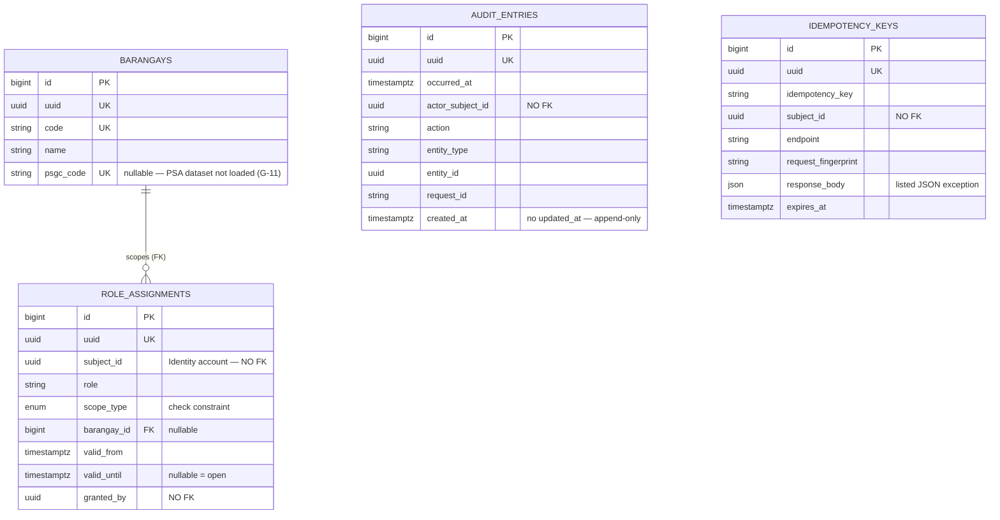

# Entity-Relationship Map — all planned domains

High-level shape of the whole schema, with **module ownership** marked. Conventions:
[ADR 0008](../adr/0008-database-conventions.md). Ownership rules:
[domain-boundary-map.md](domain-boundary-map.md).

This is a map, not a specification. Each module's TAB designs its own columns; what is
fixed here is **who owns which fact** and **where a foreign key may not go**.

## How to read it

* **Built** — the table exists today (TAB 04 foundation).
* **Planned** — the owning module's TAB creates it.
* A solid relationship is a real foreign key. It only ever appears **inside one module**.
* A dashed relationship is an **identifier reference with no foreign key** — the only way
  modules may point at each other (CLAUDE.md Article 2.2). The database does not enforce
  it; the owning module's application service does.

---

## 1. Foundation — built in TAB 04

`AUDIT_ENTRIES` and `IDEMPOTENCY_KEYS` intentionally have no relationships at all. Audit
must survive the deletion of anything it describes, and an idempotency key is a short-lived
cache keyed by caller.

---

## 2. The whole map

```mermaid
erDiagram
    ACCOUNTS ||--o{ AUTH_TOKENS : issues
    ACCOUNTS ||--o{ DEVICES : registers
    ACCOUNTS ||--o{ MFA_FACTORS : holds

    RESIDENTS ||--o{ RESIDENT_SECTORS : "tagged with"
    HOUSEHOLDS ||--o{ HOUSEHOLD_MEMBERS : contains
    RESIDENTS ||--o{ HOUSEHOLD_MEMBERS : "member of"

    CREDENTIALS ||--o{ CREDENTIAL_TRANSITIONS : "lifecycle (append-only)"
    CREDENTIALS ||--o{ CREDENTIAL_ARTIFACTS : renders

    VERIFICATION_ATTEMPTS }o--|| VERIFIER_DEVICES : "scanned by"

    PROGRAMS ||--o{ PROGRAM_REQUIREMENTS : requires
    PROGRAMS ||--o{ PROGRAM_ELIGIBILITY : "gated by"
    SERVICES ||--o{ SERVICE_CHANNELS : "offered on"

    ASSISTANCE_REQUESTS ||--o{ REQUEST_REQUIREMENTS : "must satisfy"
    ASSISTANCE_REQUESTS ||--o{ REQUEST_TRANSITIONS : "lifecycle (append-only)"
    ASSISTANCE_REQUESTS ||--o{ CASE_NOTES : "annotated by"
    ASSISTANCE_REQUESTS ||--o| ASSESSMENTS : "assessed by"
    ASSISTANCE_REQUESTS ||--o{ DISBURSEMENTS : "paid by"
    DISBURSEMENTS ||--o{ DISBURSEMENT_TRANSITIONS : "lifecycle (append-only)"
    ASSISTANCE_REQUESTS ||--o{ REFERRALS : "routed as"

    NOTIFICATIONS ||--o{ NOTIFICATION_DISPATCHES : "delivered by"
```

### Cross-module identifier references — no foreign key, ever

| From | To | Owned by | Why no FK |
| --- | --- | --- | --- |
| `role_assignments.subject_id` | account | Identity | AccessControl must not join Identity's tables |
| `audit_entries.actor_subject_id` | account | Identity | Audit must outlive the account it names |
| `idempotency_keys.subject_id` | account | Identity | Shared kernel depends on no domain |
| `residents.account_id` | account | Identity | a resident may exist with no account (walk-in) |
| `credentials.resident_id` | resident | ResidentProfile | Credential asks ResidentProfile's service |
| `assistance_requests.resident_id` | resident | ResidentProfile | ServiceDelivery asks, never joins |
| `assistance_requests.program_id` | programme | ServiceCatalog | catalog is a separate owner |
| `verification_attempts.credential_id` | credential | Credential | verification runs at the edge, sees no PII |
| `notifications.recipient_subject_id` | account | Identity | Notification decides *whether*, not *who* |

Nine references, nine places a convenient join would have silently welded two modules
together. Each is an identifier plus a service call.

---

## 3. Ownership and classification

`sensitive` follows ADR 0008 §9: RA 9262 / RA 9344 membership, health and biometric data.

| Module | Canonical tables | Highest class | Status |
| --- | --- | --- | --- |
| **Shared** | `idempotency_keys`, `barangays` | `personal` (cached response body) / `public` | **built** |
| **AccessControl** | `role_assignments` | `internal` | **built** |
| **Audit** | `audit_entries` | `internal` (records access, never the data) | **built** |
| **Identity** | `accounts`, `auth_tokens`, `devices`, `mfa_factors` | `personal` | planned — TAB 05 |
| **ResidentProfile** | `residents`, `households`, `household_members`, `resident_sectors`, `resident_addresses` | **`sensitive`** | planned |
| **ServiceCatalog** | `services`, `service_channels`, `programs`, `program_requirements`, `program_eligibility` | `public` | planned (config-backed today) |
| **Credential** | `credentials`, `credential_artifacts`, `credential_transitions` | `personal` | planned |
| **Verification** | `verification_attempts`, `verifier_devices` | `internal` | planned |
| **ServiceDelivery** | `assistance_requests`, `request_requirements`, `request_transitions`, `case_notes`, `assessments`, `disbursements`, `disbursement_transitions`, `referrals` | **`sensitive`** | planned |
| **Notification** | `notifications`, `notification_dispatches`, `notification_preferences` | `internal` | planned |

Two facts are worth stating because they are the ones most likely to be duplicated by
accident:

* **A resident's identity lives only in `residents`.** Not on the request, not on the
  credential, not on the disbursement. Those carry `resident_id`. A name copied onto an
  assistance request is a second source of truth that will disagree after the first
  correction.
* **Lifecycle history lives only in the `*_transitions` tables.** The parent row carries
  the *current* state; how it got there is append-only elsewhere (ADR 0007, ADR 0008 §12).

## 4. Patterns every planned table inherits

* `id` bigint PK + `uuid` (v7) unique — internal joins, external identifiers.
* `timestamptz` throughout; `date` for date-only facts.
* Append-only history tables: `created_at` only, no `updated_at`, no delete path.
* Soft deletes where a record must stay referenceable; never for citizen records that carry
  statutory retention.
* A unique index on every relationship pair, with any nullable column kept **out** of the
  key (ADR 0008 §5).
* Every foreign key indexed.
* No application state in JSON — the allow-list is in
  `tests/Architecture/DatabaseConventionsTest.php`.
